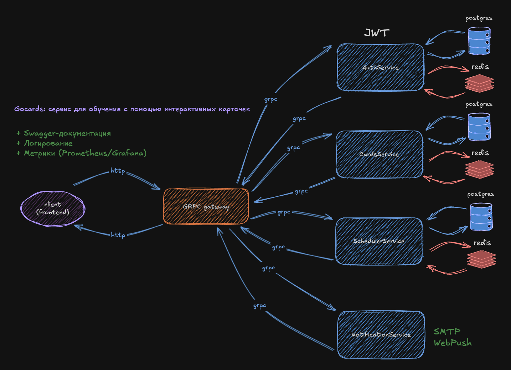

# Gocards — interactive flashcards learning platform

**Gocards** is a learning platform built around spaced-repetition and interactive flashcards.


### Tech stack (current → planned)
- **Go** • **HTTP (chi)** • **Postgres** (primary store) • **Redis** (cache/rate-limit/queues)
- **JWT (RS256)** with **JWKS** endpoint
- **Swagger/OpenAPI** (HTTP API docs)
- **Migrations** (golang-migrate/atlas)
- **Testing**: testify/gomock
- Planned: **gRPC + grpc-gateway**, **Prometheus/Grafana** metrics, **Docker Compose** stack

### Core features (MVP)
- User registration/login, access & refresh tokens (rotation)
- Decks & cards CRUD
- Study session API (spaced repetition scheduling)
- Health checks and basic metrics

## 🚀 Start

### 1. Clone the repository
```bash
git clone https://github.com/<your-username>/gocards.git
cd gocards
```
### Architecture diagram

